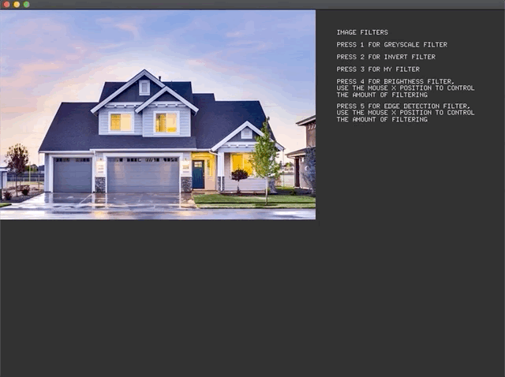

# Images-Filters

An openFrameworks application that demonstrates the following image filters; greyscale, invert, brightness, and edge detection. The application also demonstrates a custom image filter that I created. 

**Video demo:** https://vimeo.com/436801188

**Prerequisites:** openFrameworks

**Step 1:** Download [openFrameworks](https://openframeworks.cc/download/) and follow the setup guide for your OS and IDE.

**Step 2:** Create a new project using the projectGenerator, which is located in the directory openFrameworks/projectGenerator.

**Step 3:** Open the project in your IDE then from inside your IDE delete all the files inside the src directory.

**Step 4:** Download or clone this repo then copy the files inside the src directory of this repo into the src directory of the project you created.

**Step 5:** Compile the project.
